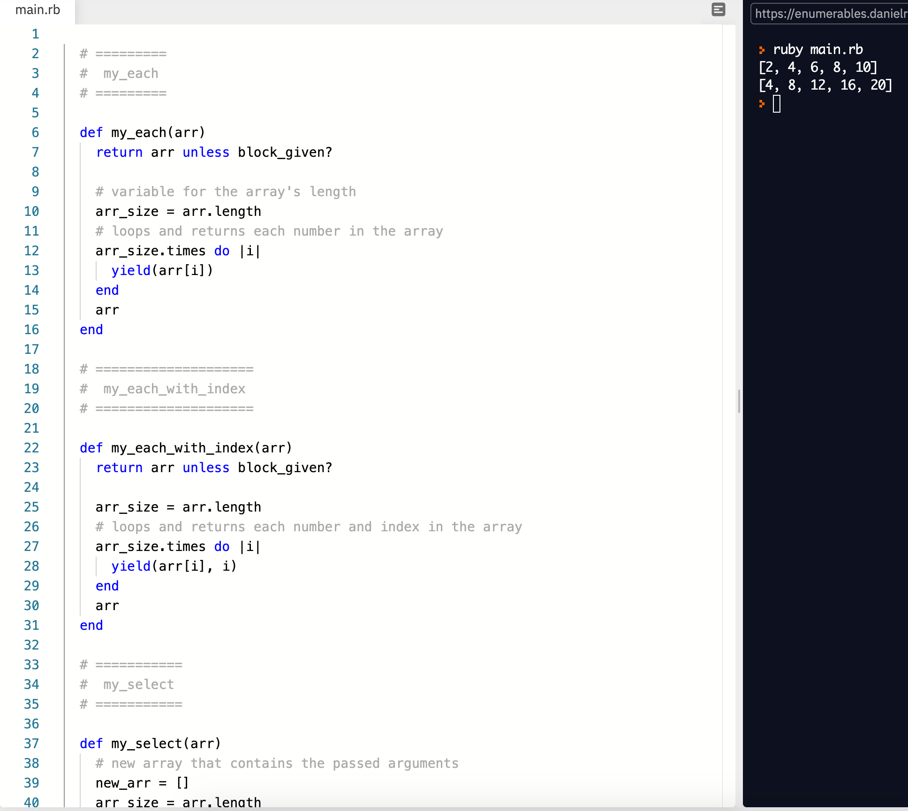
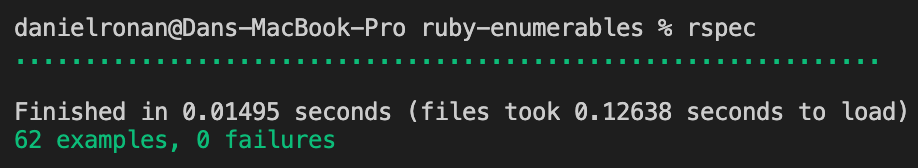

# Advanced Building Blocks - Enumerables

## Library Directory
 
| Contents        |
| ------------- |
| [Built With](#built-with) |
| [Live Demo](#live-demo) |
| [Run Tests](#run-tests) |
| [Authors](#authors) | 
| [License](#license) | 

## Description
> In this project we was given the task to create identical methods that 'Ruby' provides in our own solutions.



The methods that we created: 
```
- .each 
- .each_with_index 
- .select 
- .all 
- .any 
- .none 
- .count
- .map
- .inject
```

## Built With
```
- Ruby 4.7
- Rubocop 0.81.0
- VS Code
```

## Live Demo

#### Click on the button below..

[](https://repl.it/@DanielRonan1/enumerables#main.rb)

## Getting Started

```
1. Clone this repo by opening the terminal and entering: https://github.com/DcRonan/ruby-enumerables.git
2. Run 'cd/ruby-enumerables'
3. Run 'ruby main.rb' to get started
```

## Tests

### Install


### Run



## Authors

### 👨‍💻 Daniel Ronan
[](https://github.com/DcRonan) <br>
[](https://www.linkedin.com/in/danronan10/) <br>
[](mailto:danielconnorronan@gmail.com) <br>
[](https://twitter.com/dc_ronan)

### 👩‍💻 Losalini Rokocakau

[](https://github.com/chelmerrox) <br>
[](https://www.linkedin.com/in/losalini-rokocakau)

## Acknowledgments

### 👩‍💻 Brittany Blake 
[](https://github.com/BrittanyBlake)

### 🤝 Contributing

Contributions, issues and feature requests are welcome!

Feel free to check the [issues page](enter issues url here).

### Show your support

Give a ⭐️ if you like this project!

### License


